# 逆波兰表达式的转换与计算

简介
========

系统总体设计
------------

逆波兰表示法是由波兰数学家扬·武卡谢维奇1920年引入的数学表达式方式，在逆波兰记法中，所有操作符置于操作数的后面，因此也被称为后缀表示法。逆波兰记法不需要括号来标识操作符的优先级。

本项目使用链表实现栈，并基于栈实现中缀表达式到后缀表达式的转换，以及后缀表达式的计算。

系统功能设计
------------

|                        |                                                                              |
|------------------------|------------------------------------------------------------------------------|
| **功能**               | **说明**                                                                     |
| 输入中缀表达式         | 从标准输入读取输入作为中缀表达式，支持空行回车，整行读取                     |
| 中缀表达式转后缀表达式 | 将中缀表达式转换为后缀表达式，输出过程信息。如果输入内容存在问题将给出提示。 |
| 计算后缀表达式         | 计算后缀表达式，输出过程信息，输出计算结果。                                 |


类的设计
--------

|              |                                                         |
|--------------|---------------------------------------------------------|
| 类           | 主要成员函数的功能                                      |
| Stack\<T\>   | void push(const T value)将value压进栈                   |
|              | T pop():弹出栈顶元素并返回其值                          |
|              | const T top():返回栈顶元素的值                          |
| ComparableOp | 重载运算符\>=:可比较运算符的优先级                      |
| Infix        | string ToPostfix():将中缀表达式转为后缀表达式并将其返回 |
| Postfix      | double Calculate();计算后缀表达式的值并将其返回         |

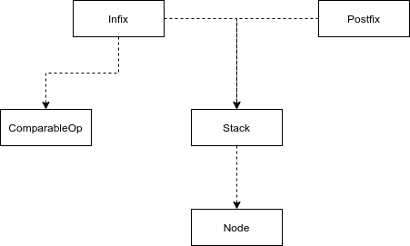

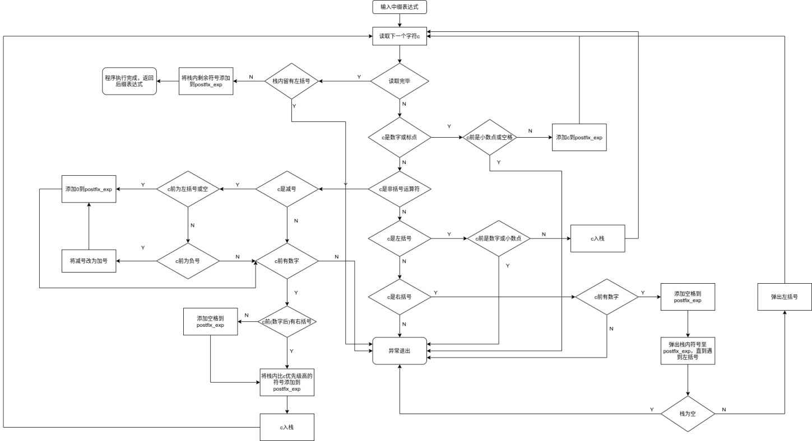

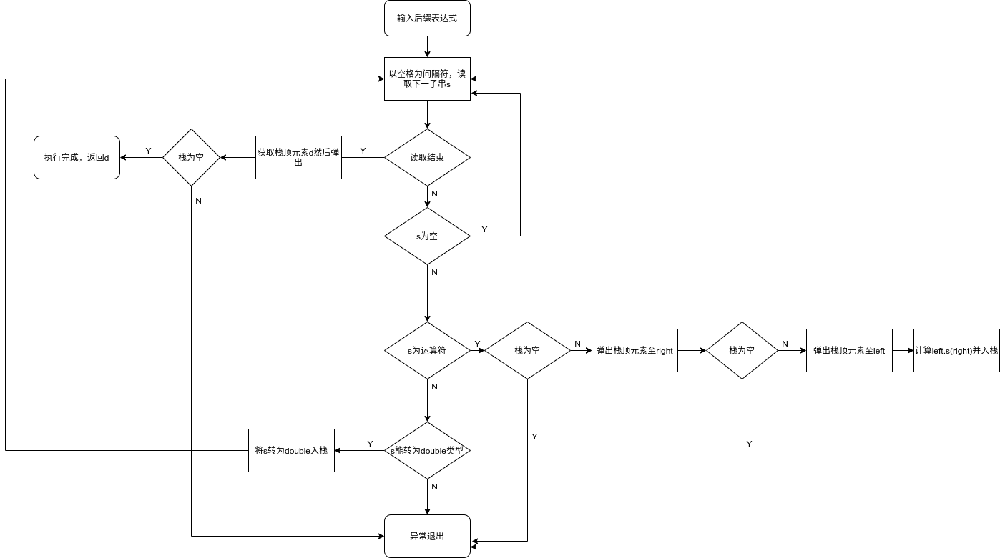

主程序的设计
------------

### 中缀表达式转后缀表达式

将中缀表达式字符串p转为后缀表达式字符串q:

```c++
string q=Infix(p).ToPostfix();
//或者:
Infix A(p);
string q;
q=A.ToPostfix();

cout<<q<<endl;
```

### 计算后缀表达式

```c++
double r=Postfix(q).Calculate();
//或者:
Postfix B(q);
double r;
r=B.Calculate();

cout<<r<<endl;
```

调试分析
========

技术难点分析
------------

### 中缀转后缀

中缀到后缀表达式的转换主要靠类Infix的方法ToPostfix()实现，这也是我花费最多精力研究的地方。

首先说下类ComparableOp，它储存某个符号以及其优先级。

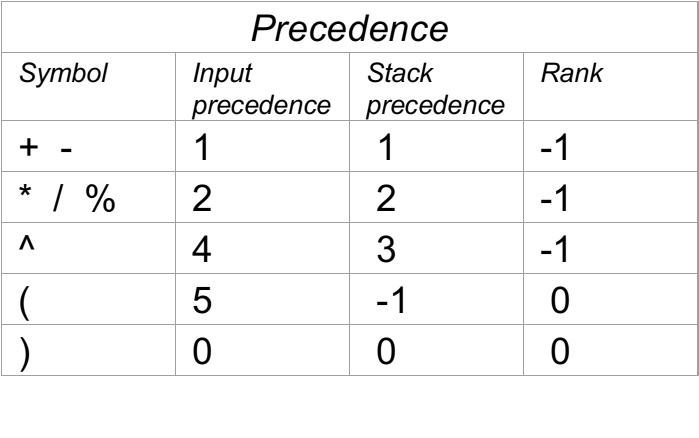

符号除了^()，两种优先度都相同。^的新来时的优先级大于栈内的优先级，是因为它是右结合的，与其他的不同。另外左括号进栈的优先度大到必定进栈，栈内优先级小则保证只有右括号才能把它弹出去。遇到右括号时，依次输出栈内的符号直到碰到左括号，再把左括号移除。

转换为后缀表达式的过程中，遇到符号按规则压入栈内，处理数字则是更大的难点。参考ppt课件，流程大致为每次读取字符串，遇到数字则加入后缀表达式，遇到符号则按规则对栈操作，并维护一个变量rank用来判断接下来是数字还是运算符或括号。

但实际情况中，需考虑到的数字不止个位数，且有可能涉及小数。为解决这个问题，我特别引入了两个量，`flag`和`last_is_bracket`，用来标记一些状态，为了能正确应对各种输入。

变量flag的目的主要是用来标记之前出现的是否为数字。这个变量以低位的3个位存储各种状态，从二进制角度看较为方便(接下来按表中记法叙述第x位):

|       |       |        |
|-------|-------|--------|
| 第3位 | 第2位 | 第1位  |
| 空格  | 数字  | 小数点 |

例如，当flag为1时代表前一位是小数点，为2时代表前一位是数字且未出现过小数点，为6时代表前面是数字后接着的空格。

变量 `last_is_bracket` 用来标记前一位是否是括号。该值为1代表前一位(如果是空格那么再往前)是左括号。为2则代表是右括号。该变量的目的是如果在括号处加过空格，就不要在运算符处再加空格。因为读取数字时没办法判断是否已经读完，故只能在处理运算符的地方给中缀表达式加上空格。

下面举例做出一些说明:

```c++
if (isdigit(ch)||ch=='.')
{
	last_is_bracket=0;
	postfix_exp += ch;
	cout<<"└──Add:"<<ch<<endl;
	if(flag>=4){//刚出现过空格，再出现数字就说明式子有问题
		throw "Infix to Postfix: Operator expected";
	}
	if(ch=='.'){
		if(flag!=2)
			throw "Infix to Postfix: Invalid dot";
		flag^=2;//去除低第2位
		flag|=1;//最低位置1
	}
	if(isdigit(ch))
		flag|=2;//低第2位置1
	
}
else if(isspace(ch)){
	if(flag>0)
		flag|=4;//标记数字后出现空格
}
```

若当前字符为数字或小数点则进入上面的代码块。

首先把`last_is_bracket`置0，表示不是括号。然后把本字符加入后缀表达式。

判断flag，若大于等于4说明之前就是空格(看下面那个else
if，它会在遇到数字后的空格时把第3位置1)，则抛出异常，提示缺少运算符。

接着，如果字符为小数点的话，首先判断第2位是否为1，若不是则说明点号左边没有任何数字，抛出异常。然后用异或运算符把第2位置0，最低位置1。

如果字符为数字，则把第二位置1.

同理，下面写出剩余的最终代码

```c++
else if (IsOperator(ch))
{
	if(ch=='-' && last_is_bracket==1){//处理负号情况,视为0-
		postfix_exp += "0 ";
		cout<<"└──Add:0\n";
		cout<<"└──Add:<SPACE>\n";
		last_is_bracket=3;//标记已有负号
	}
	else if(ch=='-' && last_is_bracket==3){//连续负号，视为0+
		postfix_exp += "0 ";
		cout<<"└──Add:0\n";
		cout<<"└──Add:<SPACE>\n";
		ch='+';//中和之前的减号
		last_is_bracket=1;//复原
	}
	else{
		if(int(flag&2)==0)//若是运算符则检查前面是否有数字。这里必须用int
			throw "Infix to Postfix: Operand expected";
		if(last_is_bracket == 0){
			postfix_exp += ' ';//添加数字后的空格
			cout<<"└──Add:<SPACE1>\n";
		}
	}
	op = ComparableOp(ch);
	CompareAndPop(op);//取出优先级更高或相等的运算符
	operator_stack.push(op);//入栈
	cout<<"└──Push:"<<op.getOp()<<endl;
	flag=0;
}
else if (ch == '('){
	if(flag != 0)
		throw "Infix to Postfix: Operator expected";//左括号前必须不是数字
	last_is_bracket=1;
	op = ComparableOp(ch);
	operator_stack.push(op);//入栈
	cout<<"└──Push:("<<endl;
	flag=0;
}
else if (ch == ')')
{
	if(int(flag&2)==0)
		throw "Infix to Postfix: Operand expected";
	flag|=4;//像空格一样有间隔开数字
	postfix_exp += ' ';//添加数字后的空格
	cout<<"└──Add:<SPACE2>\n";
	last_is_bracket=2;//告诉上一个if已经添加过空格
	op = ComparableOp(ch);
	CompareAndPop(op);//除了左括号的运算符都将出栈
	if(operator_stack.empty())
		throw "Infix to Postfix: Missing '('";//没有左括号与之配对
	else{//左括号出栈
		cout<<"└──Pop:"<<operator_stack.top().getOp()<<endl;
		operator_stack.pop(); 
	}
}
else//其他非法字符
	throw "Infix to Postfix: Invalid input";
```

isOperator()这一块中有对减号的分析，之后会再提一下。

isOperator和左括号这两者代码有部分代码重合，但也有差别，要注意左括号前不能是数字，且要记得置`last_is_bracket`为1，待会会用到。且左括号入栈是不需要检查栈内元素的，每次都是直接入栈。对于其他运算符，需要判断一下`last_is_bracket`的值然后决定是否添加空格。和左括号不一样，运算符前必须有数字(或右括号，但右括号不会影响这个判断)

遇到右括号时，也是要判断一下左边得有数字，而且应该标记flag第3位，否则之后有数字可能会直接连续上，出现一些奇怪的问题。也要记得加空格然后设置 `last_is_bracket` 。右括号的特点是会依次将栈内元素弹出直到左括号，因此弹出后若没发现左括号，则应抛出异常提示缺少左括号。

循环结束后检查flag第2位，若为1说明最后是以数字(可加右括号)结束的，是正常的。否则则说明以运算符号结束，肯定是式子有问题。

最后就是依次弹出栈内的剩余符号，此处省略说明。

### 后缀表达式运算

对后缀表达式进行运算的原理并不太难，简单说就是遇到数字则入栈，遇到运算符则取出两个计算再放回。最后栈内留下的那一个就是运算结果了。

参考课件，写出Postfix类的框架，但写计算函数需要思考另一种情况了。因为后缀表达式这个字符串现在允许多位数，小数，负数的存在，所以对数字的提取也就不能仅仅只取一位。

解决这个问题，需要找一个把字符串按空格分割的函数。遗憾的是，C++本身没有提供这种方法。但是可以尝试用string的find()来手动分割。

```c++
int last=0,next=0;
while ((next = postfix_exp.find(“ “, last)) != string::npos) {//以空格为间隔，分割string
    cout <<postfix_exp.substr(last, next-last)<<endl;
    last = next + 1; 
}
cout <<postfix_exp.substr(last);<<endl;
```

实现大概就是依照上面这样即可，注意最后还剩下一段需要substr(last)处理下。

另外string转换为double可以用math.h的stod()函数，如果处理失败抛出异常`std::invalid_argument`，`std::out_of_range`，不过经测试只要不是太离谱也不会报异常。double类型的取余可用math.h的fmod()函数。

相应最终代码如下

```c++
double Postfix::Calculate()//计算并将结果返回
{	double left, right, result,exp_value;
    string delimiter=" ";
    int last = 0;
    int next = 0;
    string token;
    try{
        if(postfix_exp.find(delimiter, last) == string::npos){//如果是简单的一个数字，无需计算直接返回
            return(stod(postfix_exp));
        }
        while ((next = postfix_exp.find(delimiter, last)) != string::npos) {//以空格为间隔，分割string
            token = postfix_exp.substr(last, next-last);
            cout << "Get string:"<<token<<endl;
            if(token.empty()){//遇到空白，跳过
                cout<<"└──empty,skipped"<<endl;
                last = next + 1;
                continue;
            }
            if(token.length()==1 && IsOperator(token[0])){//遇到运算符，取出两个数值进行运算然后再压栈
                GetOperands(left, right);
                result=Compute(left, right,token[0] );
                operand_stack.push(result);
                cout<<"└──Push:"<<result<<endl;
            }
            else{//尝试转为double类型数值然后压栈
                double num;
                num=stod(token);
                operand_stack.push(num);
                cout<<"└──Push:"<<num<<endl;
            }
            last = next + 1; 
        }
        token = postfix_exp.substr(last);//还剩余一个子串需要分析
        cout <<"Get string:"<<token<<endl;
        if(token.length()==1 && IsOperator(token[0])){
            GetOperands(left, right);
            result=Compute(left, right,token[0] );
            operand_stack.push(result);
            cout<<"└──Push:"<<result<<endl;
        }
        else if(token.empty()){
            cout<<"└──empty,skipped"<<endl;
        }
        else{//后缀表达式的最后一个字符必须是运算符
            throw "Posifix Calculate: Last position must be an operator";
        }
        exp_value = operand_stack.top();
        cout<<"└──Pop:"<<exp_value<<endl;
        operand_stack.pop();
        if (!operand_stack.empty())//栈内若还有数值则是表达式语法问题
            throw "Posifix Calculate: Too many operands";
    }catch (const std::invalid_argument&) {//不是正确的数字格式
        cerr << "Argument is invalid"<<endl;
        exit(1);
    } catch (const std::out_of_range&) {//超出double范围
        cerr << "Argument is out of range for a double\n";
        exit(1);
    } catch(const char* msg){
        cerr<<msg<<endl;//输出异常信息
        exit(1);
    }

	return exp_value;
}
```

调试错误分析
------------

### 调试错误1 

头文件被重复调用引起的问题

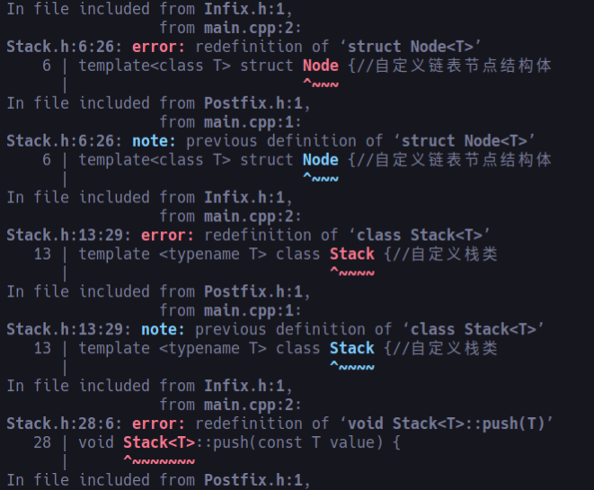

这种问题平时很少遇到，因为没有像课程设计这样大的代码需求。编译出错的原因是自定义的Node和Stack在两个文件中都被引用，造成二次定义。一般来说可以用`#pragma once` 解决，但也会产生warning输出的问题

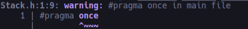

查阅资料后发现最好的解决办法就是示例头文件中的宏定义，开头加上

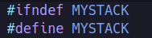

结尾加上

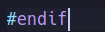

即完美解决了

### 调试错误2

负数问题

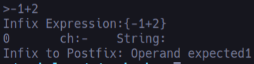

刚开始没考虑到负数的问题，一测试中遇到异常，发现还需要对减号进行特殊处理

对于负数，可以考虑将减号合并到数值的字符串里，然后便会自动被转为double类型进行计算了。但这么做的问题是负号后并不是一定紧跟着数字，也可能是表达式，例如

$$1*(-(2*3-4))$$

这里的减号不能当作普通减法来看，这样就不能使用简单的变成负数值的方法了。

另一种想法是可以直接把负数当作”0-”来处理，事实证明这是可行的，考虑以下情况都能等价

$$
-1+2 \Leftrightarrow 0-1+2
$$

$$
1*(-(2-3) \Leftrightarrow 1*(0-(2-3))
$$

$$
-(2*3)+2 \Leftrightarrow 0-(2*3)+2
$$

那么解决的思路就是优先判断减号，存在以下情况则视为负号:

1. 左边紧挨着左括号
2. 是式子的首位

要判断有没有紧挨着左括号，可以结合变量 `last_is_bracket` 实现。 `last_is_bracket` 每当遇到了括号会被赋值1或2，比如1代表左括号的话，就每次判断这个就行。然后遇到数字时就再置零。如果量 `last_is_bracket` 一开始就有设置，那么也不需要单独判断有没有位于首位，直接通过量 `last_is_bracket` 即可知道了。而且如果首部有多余空格，也不会有影响。

但测试一段时间后又发现新的问题:连续的两个减号应当是负负得正，被抵消，然而用视为0-的方法时他会变成0-0-1，即还是-1而不是1。

这个问题我的第一想法是在处理之前先作一个预处理，将连续的两个减号先消掉。但这样做并不能照顾到两减号之间有空格的情况，若要再考虑这个就会比较耗费资源，不值得每次运行都考虑这种特殊情况。后来再思考一番后，发现可以继续使用变量 `last_is_bracket` ，每当遇到“负号”时令其为3，那再判断减号时如果发现是3那就说明出现了两个连续的负号。这是可以把负号改为加号，即0-0+x，这样就被巧妙地抵消了。具体代码也能比较简洁:

```c++
if(ch=='-' && last_is_bracket==1){//处理负号情况,视为0-
	postfix_exp += "0 ";
	cout<<"└──Add:0\n";
	cout<<"└──Add:<SPACE>\n";
	last_is_bracket=3;//标记已有负号
}
else if(ch=='-' && last_is_bracket==3){//连续负号，视为0+
	postfix_exp += "0 ";
	cout<<"└──Add:0\n";
	cout<<"└──Add:<SPACE>\n";
	ch='+';//中和之前的减号
	last_is_bracket=1;//复原
}
```

下面是修整后的运行测试

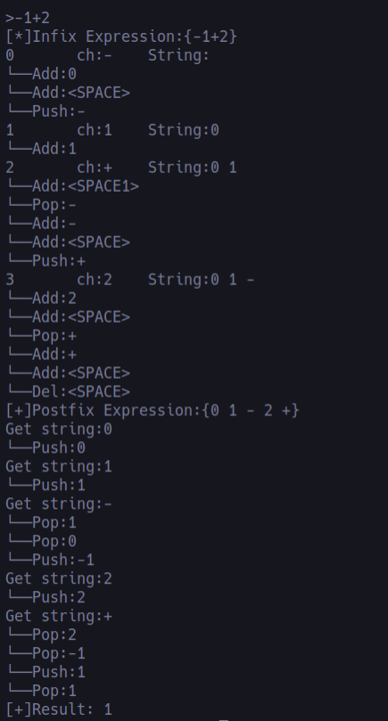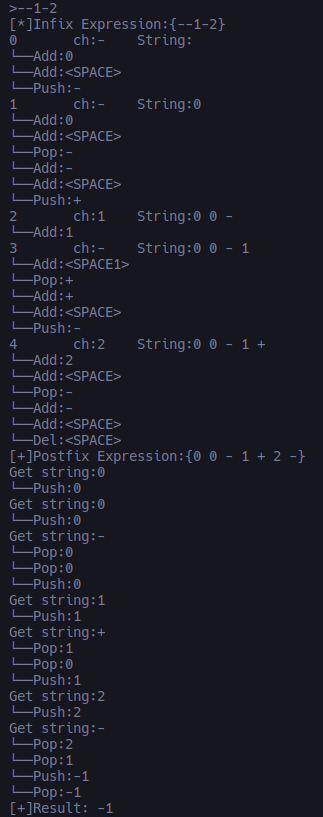

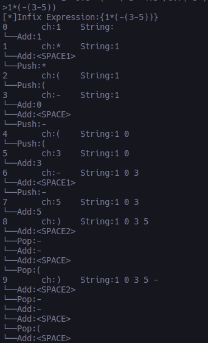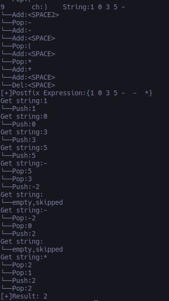

可见-x,--x,-(x+y)等形式都能正常计算了。

### 调试错误3 

整理代码时遇到的错误

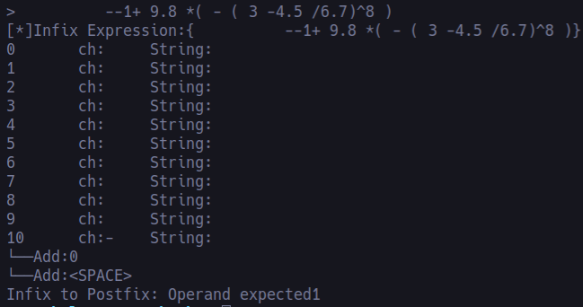

分析:

ToPostfix()函数中虽然正常运行，但代码比较杂乱，尝试整理使其高效时，遇到异常，且当有负号时才发生。

尝试对每种异常详细编号输出，终于找到原因，是误将一个else省略导致，对负号进行了多余的flag检查。

添加语句，解决

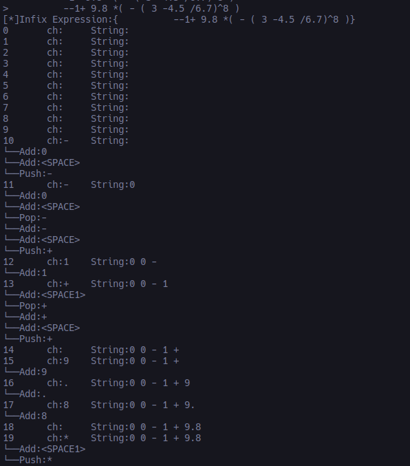

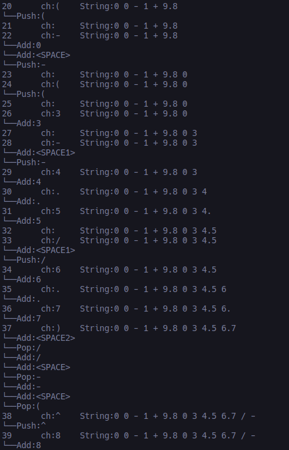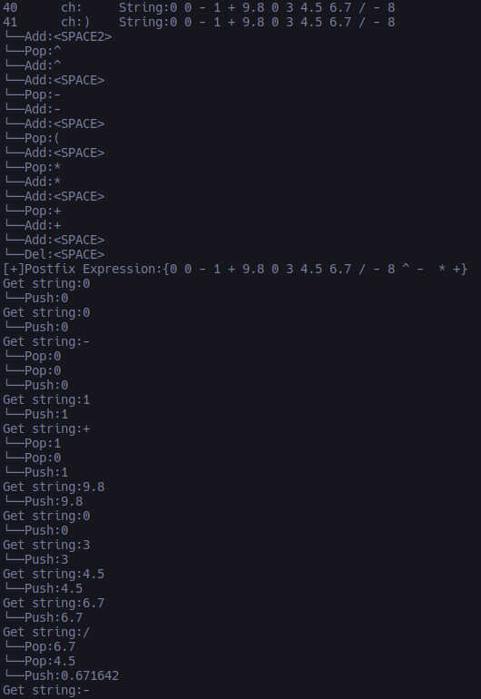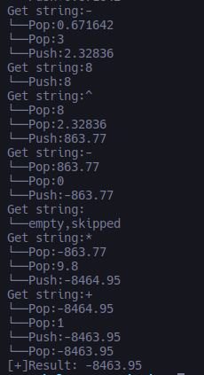


演示
====

### 测试1

本程序支持任意数量空格作为间隔

测试中缀表达式 `1+ 2 *(3 -4/5 )- 6 / 7 %    2`
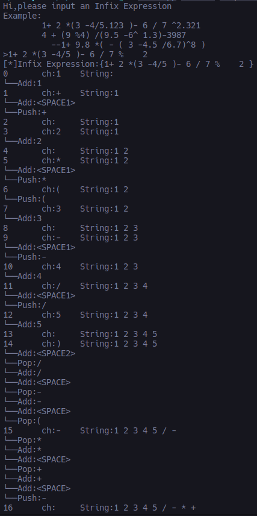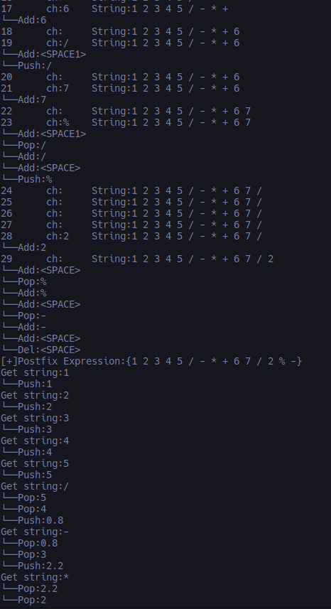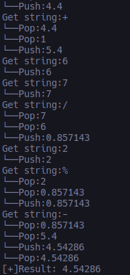

结果为4.54286，正确

### 测试2

程序支持小数，负数。测试
$$4/(-(10-9.5))$$
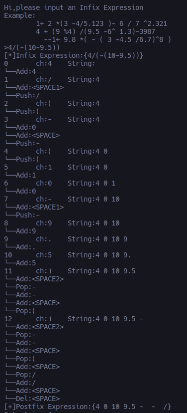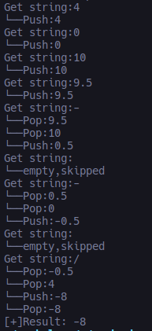

结果为-8，正确

下面测试输入的表达式不合法时能否发现异常并给出相应提示

### 测试3

测试缺少运算符:
$$(9/8)7$$

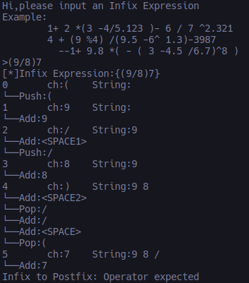

给出了异常提示。

### 测试4

测试
$$1--2$$
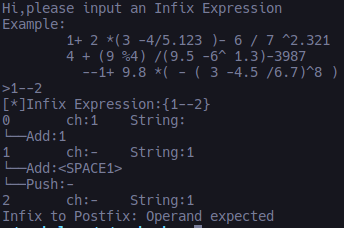

给出了异常提示。

### 测试5

测试多余小数点:
$$1.4.5*2$$

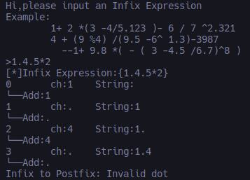

给出了异常提示。

### 测试6

测试缺少括号:
$$1+(2.3-4.5$$

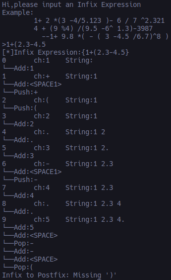

给出了异常提示。

### 测试7

测试小数点前后没有数字 
$$1. +3$$
和
$$.1+3$$

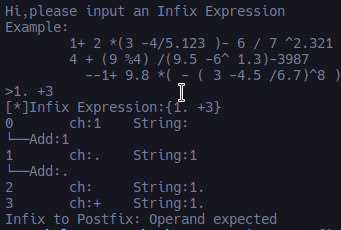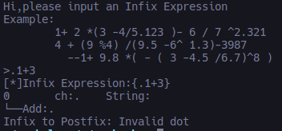

给出了异常提示。
